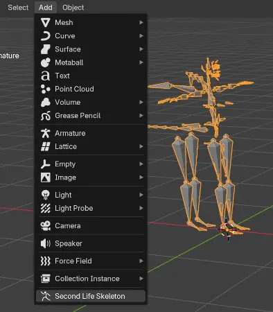
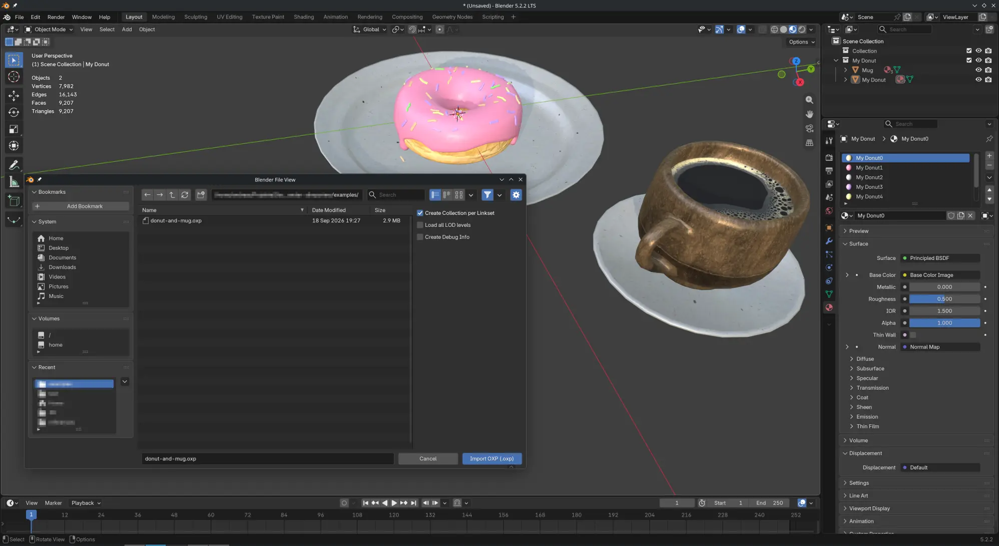
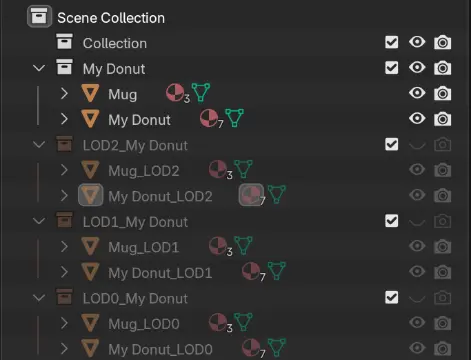
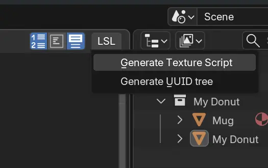

# SLImporterZ

Blender AddOn for importing various OpenSim or Second Life data.

Development in progress.

## Features

- Import default skeleton directly in the Object View `Add` menu

- Import SLM meshes (viewer cache format)

- Import objects from OXP backup files that include assets (meshes, textures and materials), that can be created by some viewers, preserving textures, skinning, PBR materials, etc.

- Import with LOD models and physics shape, if available

- Generate LSL script for setting textures and properties of imported objects
in the Scripting Text Editor within Blender

## References

- [SLM Mesh Format](https://wiki.secondlife.com/wiki/Mesh/Mesh_Asset_Format)
- [LLSD Serializtion](https://wiki.secondlife.com/wiki/LLSD)
- [PBR overrides](https://wiki.secondlife.com/wiki/GLTF_Overrides)
